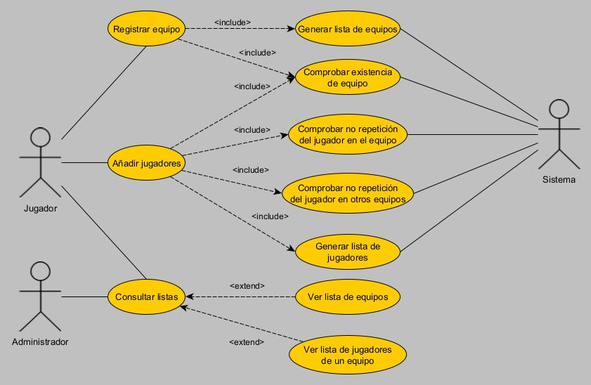
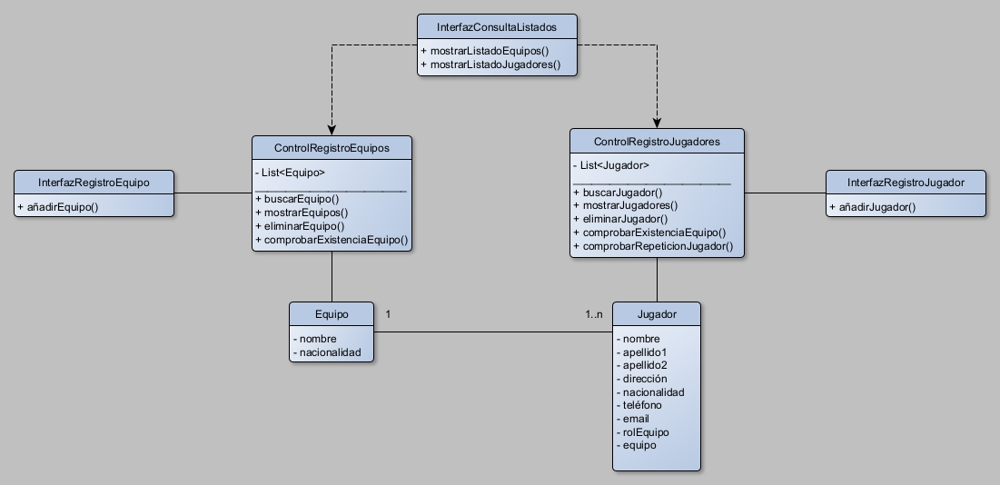

# ACTIVIDAD 3: DIAGRAMAS UML
**Autor:** Adrián Guerrero Martínez
**Fecha:** 20/04/2025
**Asignatura:** Entornos de desarrollo

# PARTE 1: Análisis del problema y requisitos del sistema
## 1. ¿Quiénes son los actores que interactúan con el sistema?
Administradores, jugadores y sistema.

## 2. ¿Cuáles son las acciones que cada actor puede realizar?
- **Administradores**: gestión interna del sistema a la que los jugadores no pueden acceder, como crear torneos y registros de resultados.
- **Jugadores**: registro de equipos, jugadores y consulta de datos.
- **Sistema**: realiza acciones automatizadas como generar emparejamientos y actualizar resultados o clasificaciones.

## 3. ¿Cómo se relacionan entre sí las entidades del sistema?
Las entidades que existen en la primera parte de "gestión de equipos y jugadores" son: equipo y jugador.
La relación que existe entre ellos es que un equipo consta de múltiples jugadores y al mismo tiempo, un jugador sólo puede pertenecer a un equipo.

# PARTE 2: Identificación de los casos de uso y elaboración del diagrama
En los casos de uso de la "Gestión de equipo y jugadores" interpreto lo siguiente:
**Registrar equipo**: considero que "Registrar equipo" es algo que puede hacer el mismo jugador mientras que la adición de equipos a un repositorio es una tarea automática que debe hacer el sistema. "Registar equipo" debe incluir siempre otro caso de uso para añadir equipos nuevos a un repositorio, comprobando previamente a través de otro caso de uso que los equipos que se registran no se encuentran ya definidos en el repositorio. Como estos casos de uso deben ocurrir siempre cada vez que se recurre a "Registrar equipo", considero que la relación adecuada debe ser `<include>`.

**Añadir jugadores**: considero también que "Añadir jugadores" es una tarea responsabilidad del jugador. Este caso de uso debe incluir otros casos de uso para comprobar que el equipo en el que se desean insertar los jugadores ya esté incluido en el repositorio. También debe comprobarse que no se repita el mismo jugador dentro del mismo equipo y que no se encuentre inscrito en ningún otro equipo. 
Finalmente, deben incluirse todos los jugadores añadidos a un repositorio de jugadores. Análogamente al caso anterior, como estos casos de uso deben ocurrir siempre cada vez que se recurre a "Añadir jugadores", considero que la relación adecuada debe ser `<include>`.

**Consultar listas**: es una tarea que pueden llevar a cabo tanto jugadores como administradores. Considero que las relaciones entre "Consultar listas" no incluyen siempre el listado de equipos o el listado de jugadores, unas veces incluirán uno de ellos y otras los dos, por eso las he definido como `<extend>`.

El diagrama de casos de uso resultante es:

# PARTE 3: Identificación de clases y relaciones
Parto de la base de qué es cada tipo de clase:
- **Clase entidad**: representan objetos del mundo real y contienen atributos y reglas de negocio simples.
- **Clases de control**: llevan a cabo labores de gestión complejas entre entidad e interfaces.
- **Clases de interfaz**: permiten al usuario interactuar con el sistema, permitiendo gestiones simples con el sistema.

Considerando el diagrama de casos de uso puedo identificar estas clases:
- Entidad (contienen los atributos de las entidades Equipo y Jugador): Equipo y Jugador.
- Control (repositorios de datos que poseen métodos de gestión del listado de equipos y jugadores): ControlRegistroEquipos y ControlRegistroJugadores.
- Interfaz (permiten interactuar con el usuario para realizar la adición de equipos, jugadores y consultar los listados): InterfazRegistroEquipos, InterfazRegistroJugadores e InterfazConsultaListados.

Respecto a las relaciones que considero en el diagrama de clases he utilizado dos tipos:
- **Relación de asociación**: cuando una clase interactúa con otra definiendo o modificando la estructura del repositorio de datos (añadir o eliminar elementos).
- **Relación de dependencia**: cuando una clase interactúa con otra sin modificar la estructura del repositorio de datos (consultas).

# PARTE 4: Creación del diagrama de clases
La única cardinalidad existente en todo este sistema tiene lugar entre las entidades reales "Jugador" y "Equipo". Dado que en un equipo pueden estar inscritos uno o múltiples jugadores (1..n) y cada uno de estos jugadores sólo puede estar inscrito en un solo equipo (1).

El diagrama de clases resultante es:

# PARTE 5: Conclusiones
El diseño de un sistema es un proceso complejo que requiere tener en cuenta en todo momento múltiples consideraciones como:
- Qué actores interactúan en el sistema y cuál es el rol de cada uno dentro del sistema.
- Delimitar las acciones de cada actor dentro del sistema y considerar todas las posibilidades que deriven de cada acción para garantizar un sistema coherente, íntegro y seguro, plasmando esto en un diagrama de casos de uso.
- Transformar el diagrama de casos de uso en un diagrama de clases pensado para la implementación en orientación a objetos, definiendo las entidades, las entidades de control y las interfaces, así como definiendo el tipo de relación que existe entre cada una (asociación, dependencia, herencia, agregación o composición).
- En todo momento de este proceso, debe llevarse a cabo una búsqueda activa de errores y mejoras potenciales para incluir en el diseño e iterar de nuevo implementando de este modo un modelo de mejora continua sobre todo el sistema que permita obtener un MVP.

Mi conclusión personal después de haber realizado este trabajo es que diseñar un sistema es una labor muy compleja. Esta labor requiere conocer qué se espera de la aplicación y cómo se desea que funcione con exactitud para poder llevar a cabo un diseño coherente. A esto se le suma la dificultad añadida de intentar prever las consecuencias de cada caso de uso en el diagrama de casos de uso y de conocer en profundidad los detalles técnicos de cada tipo de entidad y de relación en el diagrama de clases, además de su posterior implementación en un lenguaje de programación orientado a objetos.